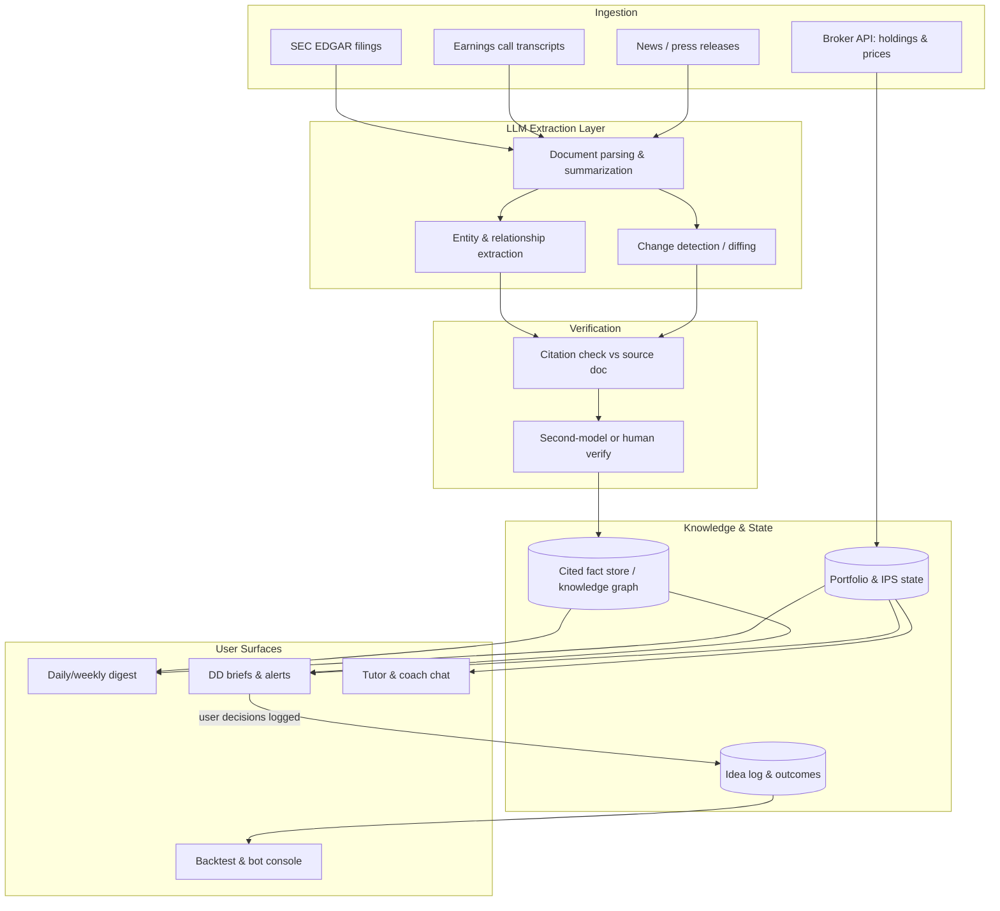
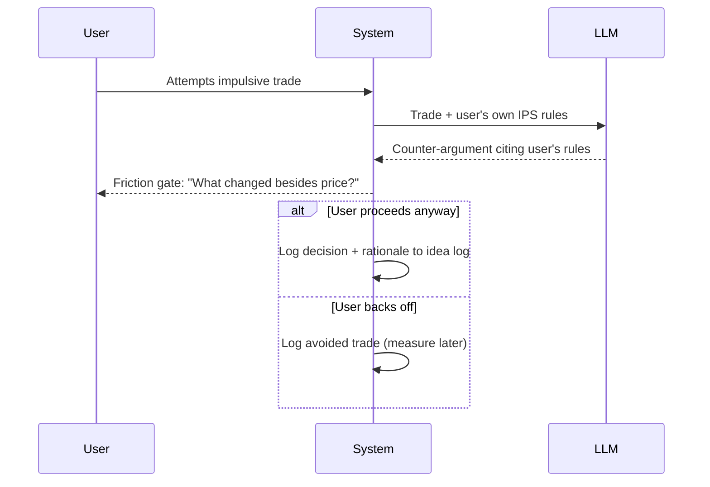
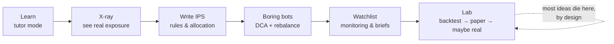

# PRD: LLM-Powered Investing Assistant

> Status: Draft / exploration — distilled from ideation on how insanely powerful models can make an individual investor smarter, more disciplined, and better-covered. Not a commitment to build.

## 1. Vision

Most retail investors lose not because they lack intelligence, but because they lack **coverage** (nobody can read every filing), **discipline** (emotions drive bad trades), and **literacy** (finance is jargon-dense on purpose). Frontier LLMs are exceptionally good at exactly those three gaps.

The product is a personal investing copilot that acts like a **very fast junior analyst + patient tutor + behavioral coach** — not a prediction machine. The core thesis:

> An LLM system won't reliably predict markets, but it can make you a dramatically faster, broader *reader* — covering 500 companies' filings the way a human analyst covers 15. The edge comes from synthesis, coverage, and discipline, not prophecy.

### Guiding principles

1. **Copilot, not oracle.** The system surfaces researched briefs with cited sources; the human decides. It never auto-trades speculatively.
2. **Every claim carries a citation.** LLMs hallucinate partnerships that don't exist. Extracted facts enter the knowledge base only after verification against a source document.
3. **Discipline > prediction.** The highest-expected-value features are the boring ones (tax mechanics, rebalancing, behavioral guardrails), ranked above signal-hunting.
4. **The boring foundation is sacred.** The product never nudges a user away from diversified index investing toward speculation. That's the failure mode, not the feature.

## 2. Who it's for

| Persona | Description | Primary need |
|---|---|---|
| **The Beginner** | Smart, technical, but a self-described "investing idiot." Has savings, maybe a 401(k). | Literacy, safe defaults, protection from classic retail mistakes |
| **The Curious Engineer** | Comfortable with code and data, wants to tinker with strategies without losing money learning | Backtesting copilot, paper trading, honest feedback on ideas |
| **The Watchlist Investor** | Owns 5–30 individual positions, can't keep up with filings and earnings calls | Monitoring, change detection, due-diligence briefs |

## 3. Product pillars & features

Ranked by expected value to the user (highest first).

### Pillar A — Financial literacy & mechanics (highest EV, zero risk)

- **Tutor mode**: interrogate any concept ("what does P/E mean and when is it misleading?", "why do bond prices fall when rates rise?") with an infinitely patient explainer calibrated to the user's level.
- **Tax & mechanics optimizer**: explains account ordering (401k match → IRA → taxable), tax-loss harvesting, long- vs short-term capital gains, asset location. These are *guaranteed* returns — a 1% tax-efficiency gain beats any speculative signal with equal expected value and none of the risk. All specifics link to primary sources; tax rules change.
- **Fee X-ray**: expense-ratio drag compounded over decades, fund overlap detection (e.g. VOO and VTI are ~85% the same holdings).

### Pillar B — Portfolio X-ray & behavioral coach

- **Exposure analysis**: paste holdings, get "what am I actually exposed to?" — sector concentration, correlated bets, the classic trap of company stock + tech-heavy 401(k) + tech job all riding the same sector.
- **Investment Policy Statement (IPS) builder**: the user writes down goals, target allocation, and rules with the model's help.
- **Pre-trade friction gate**: before any impulsive trade, the model argues against the user *using their own stated rules*: "You said you're investing for 20 years — what changed in the last 48 hours besides the price?" Most retail losses are psychology, not analysis; this is the intervention point.

### Pillar C — Research analyst (coverage & synthesis)

- **Due-diligence briefs**: before buying anything, a structured one-pager — business model, revenue trends, competitors, the bear case, insider activity, red flags in the latest filings. Not an edge over Wall Street; a "did you actually check?" gate against buying tickers off headlines.
- **Monitoring pipeline**: watches a watchlist — earnings-call summaries the day they happen, filing diffs ("what changed in the 10-K risk factors vs last year"), material-event flags, weekly five-bullet digests.
- **Relationship extraction / knowledge graph**: the ambitious tier. Ingest filings, press releases, transcripts, patents, job postings → extract structured, cited facts like `(CompanyA, partnered_with, CompanyB, date, source URL)` → accumulate into a graph. When an event lands ("X announces health hardware"), traverse: who supplies them, who supplies the suppliers, who competes. Supply-chain / second-order inference made cheap. Edge is most plausible in under-covered small caps, not mega-caps.

### Pillar D — Systematic automation (discipline, not prediction)

- **Boring bots**: dollar-cost averaging on schedule, quarterly rebalancing back to target allocation, tax-loss harvesting alerts. Zero prediction, guaranteed benefit, removes the emotional human from the loop.
- **Backtesting copilot**: the model writes and *audits* backtest code — its highest-value role is catching lookahead bias, survivorship bias, and overfitting ("your Sharpe ratio is suspiciously high; here's why"). Frameworks: `vectorbt`, `backtrader`, `zipline-reloaded`; broker APIs: Alpaca (free paper trading), Interactive Brokers.
- **Paper-trading gauntlet**: any speculative strategy must survive 6–12 months of paper trading with realistic cost modeling (spread, slippage, short-term tax drag) before real money. Most ideas die here — that's the system working.

### Explicit non-goals

- No high-frequency anything (structurally closed to individuals).
- No auto-execution of speculative trades.
- No "AI stock picks" feed. No signals sold or implied as edge.
- Numerical pattern-finding is done with statistics (pandas), never by prompting an LLM over price series — LLMs will confidently "find" noise.

## 4. System architecture



Key loop: every surfaced idea is logged with its outcome (`D3`), so the system can measure whether its briefs have any edge **before** the user risks real size.



## 5. High-level UI

Four primary surfaces. Wireframes are directional, not visual design.

### 5.1 Home — Daily digest & portfolio X-ray

```
┌────────────────────────────────────────────────────────────────┐
│  ◉ Compass                        [Digest] [Research] [Coach]  │
├──────────────────────────────┬─────────────────────────────────┤
│  TODAY'S DIGEST              │  PORTFOLIO X-RAY                │
│  ──────────────              │  ─────────────                  │
│  ▸ NVDA 10-K filed: 2 new    │   Tech        ████████░░  62% ⚠ │
│    risk factors vs FY24  [→] │   Healthcare  ██░░░░░░░░  14%   │
│  ▸ Earnings today: 3 on      │   Bonds       █░░░░░░░░░   9%   │
│    your watchlist        [→] │   Intl        █░░░░░░░░░   8%   │
│  ▸ Fund overlap: VOO ∩ VTI   │   Cash        █░░░░░░░░░   7%   │
│    ≈ 85% same holdings   [→] │                                 │
│                              │  ⚠ Concentration: your job,     │
│  WEEKLY 5 BULLETS            │    RSUs and 401(k) all ride     │
│  • ...                       │    the same sector.        [→]  │
│  • ...                       │                                 │
├──────────────────────────────┴─────────────────────────────────┤
│  Drift from IPS target: +7% equities   [ Rebalance preview → ] │
└────────────────────────────────────────────────────────────────┘
```

### 5.2 Research — DD brief with citations

```
┌────────────────────────────────────────────────────────────────┐
│  ← Back        BUTTERFLY NETWORK (BFLY)          [Add to list] │
├──────────────────────────────────────────────┬─────────────────┤
│  BRIEF                                       │  SOURCES        │
│  Business model ......................... ▾  │  [1] 10-K 2025  │
│  Revenue & trends ....................... ▾  │  [2] Q1 call    │
│  Competitors ............................ ▾  │  [3] PR 3/2025  │
│  The bear case .......................... ▾  │  [4] Form 4     │
│  Red flags in latest filing ............. ▾  │                 │
│                                              │  Every claim    │
│  RELATIONSHIP GRAPH                          │  links to a     │
│    Midjourney ──partner──▸ BFLY [3]          │  source. Un-    │
│    BFLY ──supplier──▸ TSMC (chips) [1]       │  verified =     │
│    Competes: EXO, GE Health [1]              │  not shown.     │
├──────────────────────────────────────────────┴─────────────────┤
│  ⚠ This is public information, already priced in by firms      │
│    spending $100M+ on the same analysis. Position accordingly. │
└────────────────────────────────────────────────────────────────┘
```

### 5.3 Coach — pre-trade friction gate

```
┌────────────────────────────────────────────┐
│  You're about to sell 40 sh AAPL           │
│  ──────────────────────────────            │
│  Your IPS (written by you, Mar 2026):      │
│  "Horizon 20 yrs. No selling on           │
│   drawdowns < 25%. Rebalance only          │
│   on quarterly schedule."                  │
│                                            │
│  AAPL is down 9% this week.                │
│  What changed in the last 48 hours         │
│  besides the price?                        │
│                                            │
│  [ I have a reason → explain ]             │
│  [ You're right, cancel      ]             │
│                                            │
│  (either way, this gets logged so you      │
│   can review your own track record)        │
└────────────────────────────────────────────┘
```

### 5.4 Lab — backtest & bot console

```
┌────────────────────────────────────────────────────────────────┐
│  LAB                              [Bots] [Backtests] [Paper]   │
├────────────────────────────────────────────────────────────────┤
│  BOTS (boring on purpose)                                      │
│   ● DCA: $500 → VTI, 1st of month          last run: Jul 1 ✓  │
│   ● Rebalance: quarterly, ±5% bands        next: Oct 1        │
│   ● TLH alert: threshold -$3,000           idle               │
├────────────────────────────────────────────────────────────────┤
│  BACKTEST: 200-day MA trend filter                             │
│   CAGR 8.1%  ·  Sharpe 0.71  ·  MaxDD -19%                     │
│   🔍 Audit: 2 warnings                                         │
│     ⚠ Possible lookahead: signal uses same-day close           │
│     ⚠ Costs modeled at 0 bps — add spread + slippage           │
│   Gauntlet: paper-trading day 84 of 180  ▓▓▓▓▓░░░░░            │
└────────────────────────────────────────────────────────────────┘
```

### User journey



## 6. Things to think about (open questions & risks)

### Product risks

- **The temptation gradient.** Research tooling makes speculation feel safer; the product must actively resist becoming a stock-picking casino with citations. The friction gate and EV-ranked pillars are the counterweight.
- **Hallucination = liability.** A fabricated partnership in a DD brief is worse than no brief. Verification layer is non-negotiable; unverified claims are simply not shown.
- **Measuring the system honestly.** Log every surfaced idea and outcome. If briefs show no edge after N months, say so in the product.

### Technical

- **Point-in-time correctness** is the hard problem in backtesting: use only data available at decision time (filing *acceptance* timestamps, not period dates; survivorship-bias-free universes).
- **Data sourcing tiers**: SEC EDGAR is free with an API; transcripts and news feeds get expensive fast; import/export and alt-data are pro-tier. Start free.
- **Cost control**: full-filing extraction across a 500-name universe is token-heavy; diff-first strategies (only extract what changed) cut this dramatically.

### Legal / regulatory (needs real counsel before anything ships)

- Personalized "buy/sell X" output likely crosses into investment-advice territory (RIA registration). Framing as research tooling + education keeps distance, but the line needs professional review.
- Tax explanations need "verify with a professional" framing and primary-source links.
- Broker API integration for auto-execution (even boring bots) raises custody and authorization questions.

### Honest-expectations checklist (bake into onboarding)

- Known seasonal/calendar effects are weak or arbitraged away; anything mineable from free data has been mined.
- Costs (spread, slippage, short-term tax) kill most small edges; a 55% win rate can still lose money.
- Overfitting is the default outcome of backtesting; the arc "beautiful backtest → immediate live underperformance" is the norm, not the exception.
- The user's most likely alpha source is *their own behavior*, improved.

## 7. Success metrics

| Metric | Why it matters |
|---|---|
| % of users with an IPS + at least one boring bot active | The foundation is adopted |
| Impulsive trades cancelled at the friction gate | Behavioral value, directly measurable |
| Idea-log hit rate vs benchmark (system-graded, honest) | Is the research layer actually worth anything |
| Filing-diff alerts read within 24h | Monitoring is genuinely useful, not noise |
| Speculative strategies that die in paper trading | The gauntlet is working |

## 8. Phasing sketch

1. **Phase 1 — Copilot (no accounts linked):** tutor mode, DD briefs with citations, portfolio X-ray from pasted holdings, IPS builder. Pure LLM + EDGAR, cheapest to validate.
2. **Phase 2 — Monitoring:** watchlist ingestion pipeline, filing diffs, earnings summaries, weekly digest. First persistent backend.
3. **Phase 3 — Discipline layer:** broker read-only linking, drift detection, friction gate, idea log.
4. **Phase 4 — Lab:** backtest copilot with bias auditing, paper-trading gauntlet, boring bots (execution only after the legal questions are answered).
5. **Phase 5 (research) — Knowledge graph:** relationship extraction at scale, second-order event inference. Highest ambition, only worth it if Phases 1–4 retain users.
